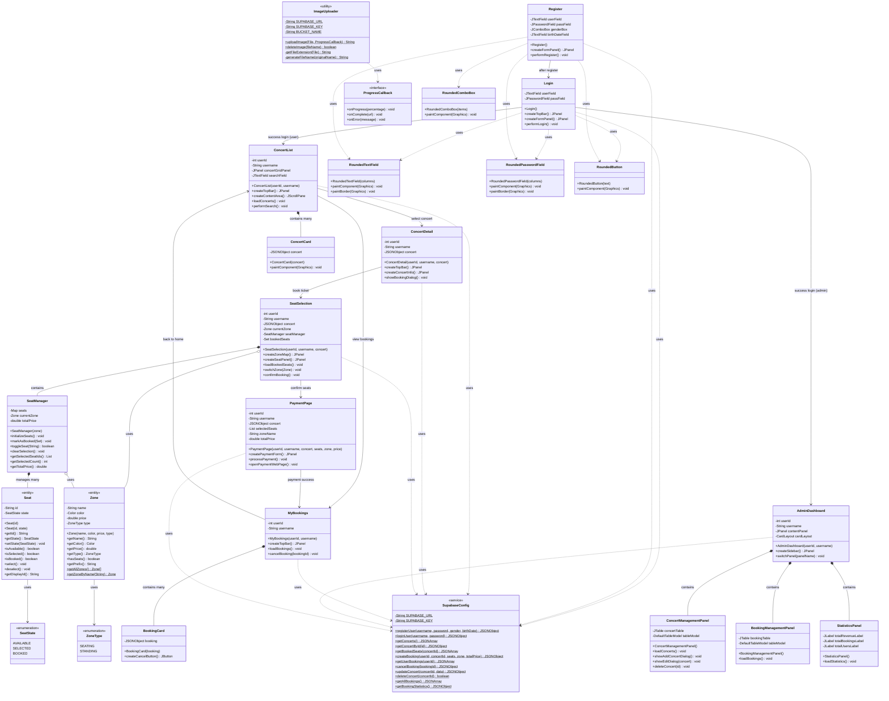

```mermaid
classDiagram
    %% Main UI Classes
    class Login {
        -JTextField userField
        -JPasswordField passField
        +Login()
        +createTopBar() JPanel
        +createFormPanel() JPanel
        +performLogin() void
    }

    class Register {
        -JTextField userField
        -JPasswordField passField
        -JComboBox genderBox
        -JTextField birthDateField
        +Register()
        +createFormPanel() JPanel
        +performRegister() void
    }

    class ConcertList {
        -int userId
        -String username
        -JPanel concertGridPanel
        -JTextField searchField
        +ConcertList(userId, username)
        +createTopBar() JPanel
        +createContentArea() JScrollPane
        +loadConcerts() void
        +performSearch() void
    }

    class ConcertDetail {
        -int userId
        -String username
        -JSONObject concert
        +ConcertDetail(userId, username, concert)
        +createTopBar() JPanel
        +createConcertInfo() JPanel
        +showBookingDialog() void
    }

    class SeatSelection {
        -int userId
        -String username
        -JSONObject concert
        -Zone currentZone
        -SeatManager seatManager
        -Set bookedSeats
        +SeatSelection(userId, username, concert)
        +createZoneMap() JPanel
        +createSeatPanel() JPanel
        +loadBookedSeats() void
        +switchZone(Zone) void
        +confirmBooking() void
    }

    class MyBookings {
        -int userId
        -String username
        +MyBookings(userId, username)
        +createTopBar() JPanel
        +loadBookings() void
        +cancelBooking(bookingId) void
    }

    class AdminDashboard {
        -int userId
        -String username
        -JPanel contentPanel
        -CardLayout cardLayout
        +AdminDashboard(userId, username)
        +createSidebar() JPanel
        +switchPanel(panelName) void
    }

    class PaymentPage {
        -int userId
        -String username
        -JSONObject concert
        -List selectedSeats
        -String zoneName
        -double totalPrice
        +PaymentPage(userId, username, concert, seats, zone, price)
        +createPaymentForm() JPanel
        +processPayment() void
        +openPaymentWebPage() void
    }

    %% Business Logic Classes
    class SeatManager {
        -Map seats
        -Zone currentZone
        -double totalPrice
        +SeatManager(zone)
        +initializeSeats() void
        +markAsBooked(Set) void
        +toggleSeat(String) boolean
        +clearSelection() void
        +getSelectedSeatIds() List
        +getSelectedCount() int
        +getTotalPrice() double
    }

    class Seat {
        <<entity>>
        -String id
        -SeatState state
        +Seat(id)
        +Seat(id, state)
        +getId() String
        +getState() SeatState
        +setState(SeatState) void
        +isAvailable() boolean
        +isSelected() boolean
        +isBooked() boolean
        +select() void
        +deselect() void
        +getDisplayId() String
    }

    class Zone {
        <<entity>>
        -String name
        -Color color
        -double price
        -ZoneType type
        +Zone(name, color, price, type)
        +getName() String
        +getColor() Color
        +getPrice() double
        +getType() ZoneType
        +hasSeats() boolean
        +getPrefix() String
        +getAllZones()$ Zone[]
        +getZoneByName(String)$ Zone
    }

    %% Enums
    class SeatState {
        <<enumeration>>
        AVAILABLE
        SELECTED
        BOOKED
    }

    class ZoneType {
        <<enumeration>>
        SEATING
        STANDING
    }

    %% Database/API Class
    class SupabaseConfig {
        <<service>>
        -String SUPABASE_URL$
        -String SUPABASE_KEY$
        +registerUser(username, password, gender, birthDate)$ JSONObject
        +loginUser(username, password)$ JSONObject
        +getConcerts()$ JSONArray
        +getConcertById(id)$ JSONObject
        +getBookedSeats(concertId)$ JSONArray
        +createBooking(userId, concertId, seats, zone, totalPrice)$ JSONObject
        +getUserBookings(userId)$ JSONArray
        +cancelBooking(bookingId)$ JSONObject
        +updateConcert(concertId, data)$ JSONObject
        +deleteConcert(concertId)$ boolean
        +getAllBookings()$ JSONArray
        +getBookingStatistics()$ JSONObject
    }

    class ImageUploader {
        <<utility>>
        -String SUPABASE_URL$
        -String SUPABASE_KEY$
        -String BUCKET_NAME$
        +uploadImage(File, ProgressCallback)$ String
        +deleteImage(fileName)$ boolean
        -getFileExtension(File)$ String
        -generateFileName(originalName)$ String
    }

    class ProgressCallback {
        <<interface>>
        +onProgress(percentage) void
        +onComplete(url) void
        +onError(message) void
    }

    %% Inner/Nested Classes
    class ConcertCard {
        -JSONObject concert
        +ConcertCard(concert)
        +paintComponent(Graphics) void
    }

    class BookingCard {
        -JSONObject booking
        +BookingCard(booking)
        +createCancelButton() JButton
    }

    class ConcertManagementPanel {
        -JTable concertTable
        -DefaultTableModel tableModel
        +ConcertManagementPanel()
        +loadConcerts() void
        +showAddConcertDialog() void
        +showEditDialog(concert) void
        +deleteConcert(id) void
    }

    class BookingManagementPanel {
        -JTable bookingTable
        -DefaultTableModel tableModel
        +BookingManagementPanel()
        +loadBookings() void
    }

    class StatisticsPanel {
        -JLabel totalRevenueLabel
        -JLabel totalBookingsLabel
        -JLabel totalUsersLabel
        +StatisticsPanel()
        +loadStatistics() void
    }

    %% Custom UI Components
    class RoundedTextField {
        +RoundedTextField(columns)
        +paintComponent(Graphics) void
        +paintBorder(Graphics) void
    }

    class RoundedPasswordField {
        +RoundedPasswordField(columns)
        +paintComponent(Graphics) void
        +paintBorder(Graphics) void
    }

    class RoundedButton {
        +RoundedButton(text)
        +paintComponent(Graphics) void
    }

    class RoundedComboBox {
        +RoundedComboBox(items)
        +paintComponent(Graphics) void
    }

    %% Relationships - Navigation Flow
    Login --> ConcertList : success login (user)
    Login --> AdminDashboard : success login (admin)
    Register --> Login : after register
    ConcertList --> ConcertDetail : select concert
    ConcertList --> MyBookings : view bookings
    ConcertDetail --> SeatSelection : book ticket
    SeatSelection --> PaymentPage : confirm seats
    PaymentPage --> MyBookings : payment success
    MyBookings --> ConcertList : back to home

    %% Relationships - Composition/Aggregation
    SeatSelection *-- SeatManager : contains
    SeatManager *-- Seat : manages many
    SeatSelection o-- Zone : uses
    SeatManager o-- Zone : uses
    Seat --> SeatState : uses
    Zone --> ZoneType : uses

    %% Relationships - Dependencies
    Login ..> SupabaseConfig : uses
    Register ..> SupabaseConfig : uses
    ConcertList ..> SupabaseConfig : uses
    ConcertDetail ..> SupabaseConfig : uses
    SeatSelection ..> SupabaseConfig : uses
    MyBookings ..> SupabaseConfig : uses
    AdminDashboard ..> SupabaseConfig : uses
    PaymentPage ..> SupabaseConfig : uses

    AdminDashboard *-- ConcertManagementPanel : contains
    AdminDashboard *-- BookingManagementPanel : contains
    AdminDashboard *-- StatisticsPanel : contains

    ConcertList *-- ConcertCard : contains many
    MyBookings *-- BookingCard : contains many

    ImageUploader ..> ProgressCallback : uses

    %% UI Components Usage
    Login ..> RoundedTextField : uses
    Login ..> RoundedPasswordField : uses
    Login ..> RoundedButton : uses
    Register ..> RoundedTextField : uses
    Register ..> RoundedPasswordField : uses
    Register ..> RoundedButton : uses
    Register ..> RoundedComboBox : uses
```
